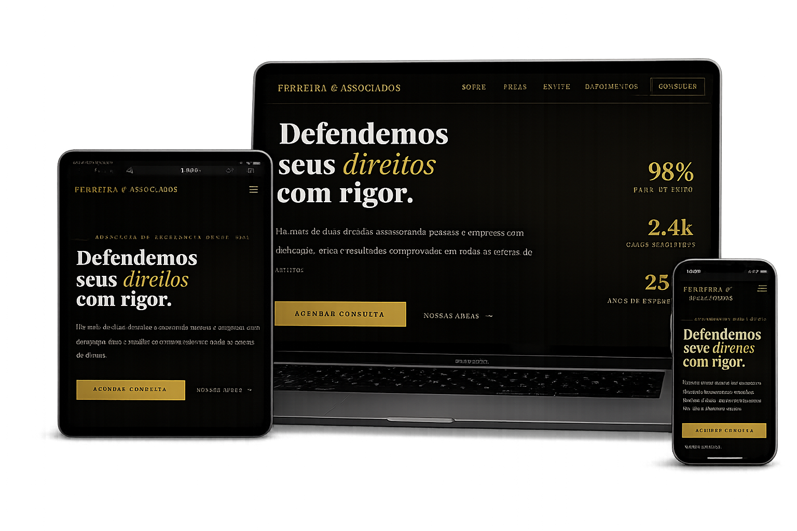

# ⚖️ Landing Page - Escritório Jurídico

Landing page moderna e estratégica desenvolvida para escritórios de advocacia que desejam fortalecer presença digital, transmitir autoridade e gerar novos clientes de forma consistente.

---

## 📌 Visão Geral

Este projeto consiste em um site institucional completo para um escritório jurídico, com foco em:

- Credibilidade visual
- Clareza na comunicação
- Conversão de visitantes em leads

A estrutura foi pensada para destacar experiência, áreas de atuação e facilitar o contato direto com potenciais clientes.

---

## 🚀 Tecnologias Utilizadas

- HTML5 → Estrutura semântica e otimizada
- CSS3 → Estilização moderna, responsiva e performática
- JavaScript → Interações e comportamento dinâmico

---

## 🎯 Objetivo do Projeto

- Construir autoridade digital para o escritório
- Gerar leads qualificados através de CTAs estratégicos
- Oferecer navegação fluida e intuitiva
- Garantir experiência consistente em qualquer dispositivo

---

## 🧠 Estrutura do Projeto

📁 projeto-juridico
 
 ├── 📁 assets
  
 │   ├── 📁 images
  
 │   └── 📁 icon
  
 ├── index.html
  
 ├── style.css
  
 └── script.js

 ---
 
## 📱 Responsividade

O projeto foi desenvolvido com adaptação completa para:

- Smartphones
- Tablets
- Desktops

---

## ⚙️ Funcionalidades

- Menu responsivo (mobile e desktop)
- Scroll suave entre seções
- Seções institucionais estratégicas:
    - Sobre o escritório
    - Áreas de atuação
    - Equipe
    - Depoimentos
- Call-to-actions otimizados para conversão
- Botão de contato direto (WhatsApp ou formulário)
- Estrutura preparada para SEO básico

---

## 📸 Preview do Projeto

---

## 🔗 Deploy

A aplicação pode ser acessada através do link:

https://esc-adv-demo.netlify.app/

---

## 📈 Estratégia de Conversão

Este site não é apenas visual, ele foi estruturado com base em princípios de conversão:

- Hierarquia visual clara
- Headlines com foco em benefício
- CTAs posicionados em pontos de decisão
- Redução de fricção no contato

---

## 💼 Aplicação Comercial

Este modelo pode ser utilizado por:

- Escritórios de advocacia
- Advogados autônomos
- Consultorias jurídicas

---

## 🔧 Possíveis Melhorias Futuras
- Integração com API de agendamento
- Formulário com envio automático (backend)
- Integração com CRM
- Implementação de blog jurídico
- Otimização avançada de SEO

---

## 👨‍💻 Autor

Desenvolvido por Geovane Allen

Portfólio: https://devforgeweb.netlify.app/
 
Contato: https://wa.me/5585991986569
